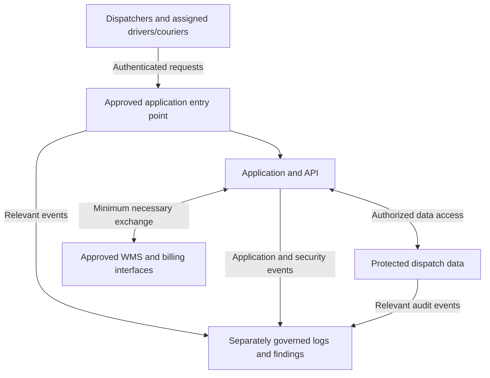

# AWS Reference Architecture

**Status:** Proposed logical architecture; specific AWS compute, database, networking, and integration services have not been selected.

## Account boundaries

| Boundary | Proposed contents or purpose |
|---|---|
| Management/billing account | Organization administration; no routine dispatch workload. |
| Production workload account | Entry point, application components, data tier, and approved interfaces. |
| Nonproduction workload account | Development and tests using synthetic or approved de-identified data. |
| Security/logging boundary | Restricted storage and review of selected events and findings. |

The account layout and services must be finalized in the implementation design. Backups require a protected recovery arrangement that ordinary workload access cannot readily compromise. The diagram shows logical event flows; it does not imply that every data-store action is logged automatically.

Control connections: CLD-01, CLD-04, CLD-05, CLD-07, and CLD-11.
