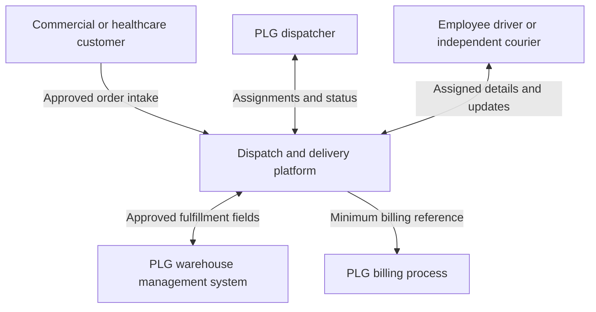

# Dispatch Workload Context Diagram

**Status:** Proposed logical design for a fictional PLG workload.

## Interpretation

The platform mediates delivery assignments and updates. A courier does not connect directly to the WMS or billing process through this design. The customer order intake channel, WMS interface, and billing transfer require implementation details and approved data fields before deployment.

The courier connection crosses an external-device boundary; the WMS and billing links cross from the proposed AWS workload into existing PLG systems. See `data-flow-and-trust-boundaries.md` for the control implications.
