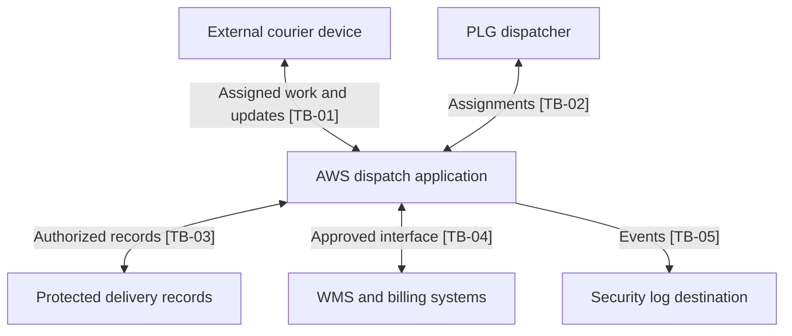

# Data Flow and Trust Boundaries

**Status:** Proposed logical flows. Field lists, interfaces, and network paths require validation.

## Boundary decisions

| Boundary | Crossing | Required design decision |
|---|---|---|
| TB-01 | External courier device ↔ application | Authenticate the individual and authorize each current assignment. |
| TB-02 | PLG workforce ↔ application | Verify employee identity and dispatcher scope. |
| TB-03 | Application ↔ protected records | Restrict component access, protect data, and validate record authorization. |
| TB-04 | AWS workload ↔ WMS/billing | Authenticate interfaces; approve fields, direction, retries, and reconciliation. |
| TB-05 | Workload ↔ security destination | Define sources, destination access, retention, and coverage tests. |

This diagram uses the same TB-01 through TB-05 labels as `docs/04-data-flows-and-trust-boundaries.md`. Customer intake is shown in `context-diagram.md`; its channel must be documented during implementation.
