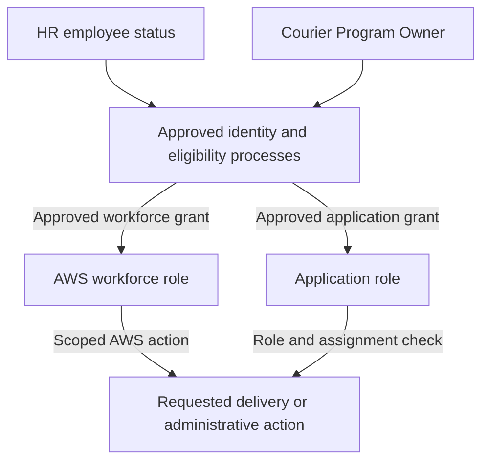

# Identity and Access Flow

**Status:** Proposed access model; identity systems and technical integration remain to be selected.

## Separation of decisions

The two paths lead to **different actions**: the AWS role governs approved AWS administration; the application role governs dispatch functions. The final action node is a compact diagram label, not a claim that the roles are interchangeable.

A courier should receive an application identity and assignment-level permission, not AWS workforce administration access. A dispatcher does not gain AWS administrator privileges by being able to assign deliveries.

The application checks authorization for each delivery request, including when an assignment changes or a user supplies a different record identifier. Employee status and courier eligibility changes trigger access updates under `procedures/access-provisioning-and-review.md`.

Control connections: CLD-02, CLD-03, and CLD-09.
