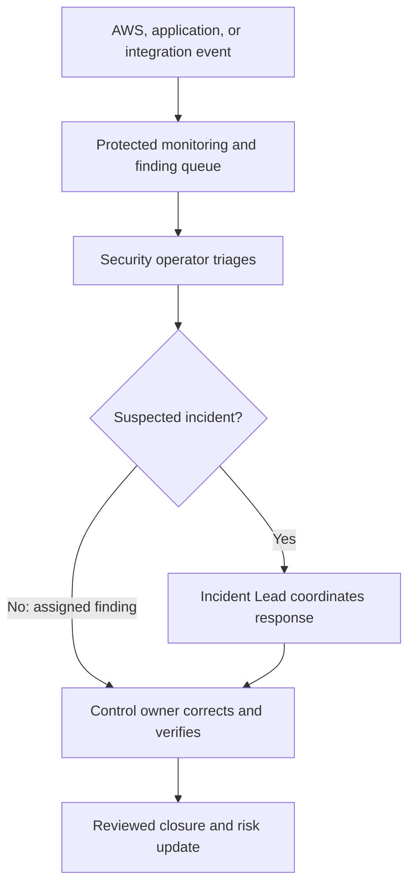

# Security Event Workflow

**Status:** Proposed operating workflow, not an executed incident history.

## Operating notes

The operator records source, time, affected environment, severity, owner, and validation steps. A suspected active compromise or material disruption is escalated under `procedures/cloud-incident-response.md`. Other findings remain assigned and tracked under `procedures/security-finding-triage.md`.

Closing a finding requires a documented disposition and verification. Missing expected logs are themselves a control gap under CLD-07. A queue or detection service does not replace staffed review and business decisions.

Control connections: CLD-07, CLD-08, and CLD-12.
